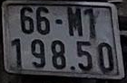
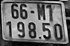
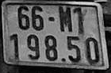
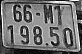

# Báo cáo các phương pháp tiền xử lý ảnh tốt nhất cho PARSeq ANPR

## 1. Mục tiêu và phạm vi

Báo cáo này tổng hợp các phương pháp tiền xử lý ảnh đã cho kết quả tốt nhất với
checkpoint PARSeq hiện tại. Kết quả chính được đo trên 411 ảnh test, đầu vào mô
hình được resize về `32 × 128`, giải mã với `refine_iters=2`.

Hai chỉ số được sử dụng:

- **Exact match**: một ảnh chỉ được tính đúng khi toàn bộ chuỗi biển số đúng.
- **Character accuracy**: `1 - tổng khoảng cách Levenshtein / tổng số ký tự`.

`train_baseline` là mốc so sánh, gồm:

```text
RGB → grayscale → CLAHE clip 2.0/grid 8×8
    → bilateral d=5, sigmaColor=50, sigmaSpace=50
    → unsharp mask alpha=0.5, sigma=1.0
```

Baseline đạt **91,97% exact match** và **98,87% character accuracy**. Kết quả
cho thấy baseline có xu hướng xử lý hơi mạnh: CLAHE, bilateral và unsharp cùng
thay đổi ảnh, đôi khi làm nhiễu hoặc biên giả nổi rõ hơn nét thật.

## 2. Kết quả tổng hợp

| Phương pháp | Exact match | Character accuracy | Chênh lệch so với baseline | Vai trò phù hợp |
| --- | ---: | ---: | ---: | --- |
| `adaptive_noise_3way` | **93,43%** | 98,99% | **+1,46 / +0,12 điểm %** | Ưu tiên exact match, ảnh đầu vào không đồng nhất |
| `clahe_rl_deblur_bilateral` | **93,43%** | 98,93% | **+1,46 / +0,06 điểm %** | Chuỗi cố định, ưu tiên exact match |
| `clahe_clip1_tile4` | 93,19% | **99,08%** | +1,22 / **+0,21 điểm %** | Lựa chọn mặc định gọn, nhanh, ít rủi ro |
| `raw_rgb` | 93,19% | 98,99% | +1,22 / +0,12 điểm % | Đối chứng và fallback |
| `train_baseline` | 91,97% | 98,87% | 0 / 0 | Mốc so sánh |

`adaptive_noise_3way` sửa đúng 10 ảnh baseline nhận sai nhưng làm sai 4 ảnh
baseline vốn đúng. `clahe_rl_deblur_bilateral` sửa đúng 9 và làm sai 3 ảnh.
`clahe_clip1_tile4` sửa đúng 9 và làm sai 4 ảnh; tổng lỗi ký tự giảm từ 38 xuống
31.

Mức tăng của ba phương pháp tốt nhất vẫn cần được hiểu là **kết quả thực
nghiệm**, chưa phải bằng chứng thống kê chắc chắn: khoảng tin cậy bootstrap 95%
trên test còn chạm hoặc cắt qua 0. Tập 411 ảnh cũng đã được dùng để xác nhận
nhiều vòng thử nghiệm, vì vậy cần một holdout mới trước khi chốt production.

## 3. Phương pháp 1 — CLAHE nhẹ (`clahe_clip1_tile4`)

### 3.1. Cấu hình

```text
RGB → grayscale luma → CLAHE clipLimit=1.0, tileGridSize=4×4
    → bicubic resize 32×128 → normalize → PARSeq
```

Lưu ý: `tileGridSize=4×4` nghĩa là ảnh được chia thành lưới 4 hàng × 4 cột,
không phải mỗi ô có kích thước 4 × 4 pixel.

### 3.2. CLAHE hoạt động như thế nào?

1. Ảnh RGB được đổi sang mức xám luma. Có thể xem gần đúng là
   `Y = 0,299R + 0,587G + 0,114B`.
2. Ảnh xám được chia thành các vùng cục bộ. Mỗi vùng có histogram riêng, vì vậy
   vùng tối và vùng sáng không phải dùng chung một phép ánh xạ toàn cục.
3. Số pixel trong các bin histogram bị giới hạn bởi `clipLimit`. Phần vượt
   ngưỡng được phân phối lại cho các bin còn lại. Bước này ngăn một dải mức xám
   nhỏ bị kéo giãn quá mạnh và ngăn nhiễu được khuếch đại không kiểm soát.
4. Hàm phân phối tích lũy (CDF) của từng vùng ánh xạ mức xám cũ sang mức xám
   mới, làm tăng tương phản giữa nét ký tự và nền biển.
5. Kết quả của các vùng lân cận được nội suy song tuyến tính ở biên để tránh
   xuất hiện đường nối giữa các ô.

### 3.3. Vì sao cải thiện độ chính xác?

- Nét chữ mờ trong vùng thiếu sáng được tách khỏi nền tốt hơn.
- Tương phản được tăng theo từng vùng nên chịu được bóng đổ và phản sáng tốt
  hơn histogram equalization toàn cục.
- `clipLimit=1.0` nhẹ hơn baseline `2.0`; lưới `4×4` cũng tạo vùng thống kê lớn
  hơn lưới `8×8`. Do đó đầu ra ít hạt, ít halo và ít làm đứt hoặc dày nét.
- Không dùng thêm bilateral hay unsharp nên giữ ảnh gần phân phối tự nhiên mà
  PARSeq đã học, đồng thời giảm nguy cơ tạo đặc trưng giả.

Đây là cấu hình được khuyến nghị nếu cần cân bằng **độ chính xác ký tự, tốc độ,
độ đơn giản và khả năng bảo trì**.

## 4. Phương pháp 2 — CLAHE + Richardson–Lucy + bilateral

Tên cấu hình: `clahe_rl_deblur_bilateral`.

### 4.1. Chuỗi xử lý

```text
RGB → grayscale → CLAHE 1.0/grid 4×4
    → Richardson–Lucy 3 vòng, Gaussian PSF 3×3, sigma=0.7
    → bilateral d=3, sigmaColor=25, sigmaSpace=25
    → bicubic resize 32×128 → PARSeq
```

Thứ tự này quan trọng: CLAHE làm rõ chênh lệch sáng tối, Richardson–Lucy khôi
phục thành phần tần số cao bị blur, còn bilateral ở cuối giảm nhiễu và ringing
do deconvolution sinh ra.

### 4.2. Richardson–Lucy hoạt động như thế nào?

Ảnh quan sát được mô hình hóa gần đúng:

```text
y = h ⊗ x + n
```

Trong đó `x` là ảnh nét cần tìm, `h` là hàm lan truyền điểm (PSF), `⊗` là phép
tích chập và `n` là nhiễu. Pipeline giả định blur gần Gaussian với kernel `3×3`,
`sigma=0.7`.

Richardson–Lucy cập nhật lặp:

```text
x(t+1) = x(t) · [h_flip ⊗ (y / (h ⊗ x(t)))]
```

- `h ⊗ x(t)` dự đoán ảnh mờ từ ước lượng hiện tại.
- Tỷ lệ `y / (h ⊗ x(t))` đo phần chưa khớp giữa quan sát và dự đoán.
- Tích chập với `h_flip` đưa sai lệch trở lại các pixel nguồn.
- Nhân với `x(t)` tạo ước lượng mới không âm.

Chỉ chạy **3 vòng** để khôi phục nét vừa đủ. Chạy quá nhiều vòng thường khuếch
đại noise, tạo viền sáng/tối và làm hình dạng ký tự sai lệch.

### 4.3. Bilateral filter hoạt động như thế nào?

Với pixel trung tâm `p`, đầu ra là trung bình có trọng số của các pixel `q`
xung quanh:

```text
I'(p) = (1 / Wp) · Σq I(q)
        · exp(-||p-q||² / 2σs²)
        · exp(-|I(p)-I(q)|² / 2σr²)
```

Trọng số gồm hai phần:

- khoảng cách không gian: pixel càng xa càng ít ảnh hưởng;
- khoảng cách cường độ: pixel khác sáng tối quá nhiều ít được trộn vào nhau.

Vì vậy bilateral làm mượt nhiễu trong nền nhưng giữ được biên nét ký tự. Ở đây
tham số `d=3`, `sigmaColor=25`, `sigmaSpace=25` khá nhẹ, chủ yếu dọn ringing sau
deblur.

### 4.4. Vì sao cải thiện độ chính xác?

- Khôi phục một phần nét mảnh bị mất do rung, defocus hoặc crop độ phân giải
  thấp.
- Làm các ký tự dễ nhầm như `1/I`, `5/S`, `8/B`, `0/D` có hình dạng rõ hơn.
- Bilateral hạn chế cái giá phải trả của inverse filtering: nhiễu cao tần và
  viền giả.

Nhược điểm là PSF Gaussian chỉ là giả định. Nếu blur thật không khớp, RL có thể
tạo chi tiết sai. Kết quả của phương pháp này chỉ hơn CLAHE nhẹ đúng 1/411 ảnh và
character accuracy thấp hơn, nên chưa đủ lý do để thay CLAHE trong production.

## 5. Phương pháp 3 — Router thích ứng theo nhiễu

Tên cấu hình: `adaptive_noise_3way`.

### 5.1. Đo đặc trưng ảnh

Ảnh được đổi sang grayscale `G`, sau đó tính phần dư cao tần so với Gaussian
blur `3×3`:

```text
R = |G - GaussianBlur3×3(G)|
noise_score = median(R)
```

Median được dùng thay mean để một số cạnh rất mạnh hoặc điểm sáng không chi
phối toàn bộ chỉ số. Tuy nhiên đây chỉ là **đại lượng đại diện cho năng lượng cao
tần**, không phải phép đo nhiễu cảm biến thuần túy: nét ký tự và texture cũng góp
phần vào giá trị này.

### 5.2. Luật chọn pipeline

```text
noise_score ≤ 5       → homomorphic_filter
5 < noise_score ≤ 10  → clahe_rl_deblur_bilateral
noise_score > 10      → rl_deblur_bilateral_lowpass
```

Các ngưỡng được khóa từ validation trước khi đánh giá test. Router không dùng
nhãn và không chạy PARSeq để quyết định nhánh.

### 5.3. Nhánh homomorphic

Homomorphic filtering dựa trên mô hình ảnh:

```text
I(x,y) = L(x,y) · R(x,y)
```

`L` là chiếu sáng biến thiên chậm (tần số thấp), `R` là phản xạ và chi tiết nét
(tần số cao). Lấy log biến phép nhân thành phép cộng, sau đó lọc trong miền tần
số:

```text
log(I) = log(L) + log(R)
```

Pipeline giảm gain tần số thấp xuống `0.7`, tăng dần gain tần số cao tới `1.4`,
biến đổi Fourier ngược, lấy `exp` và co giãn robust percentile `1–99%`. Kết quả
giảm bóng đổ/chiếu sáng không đều và làm nét chữ nổi rõ hơn mà không nhị phân
hóa ảnh.

### 5.4. Vì sao router tốt hơn một cấu hình cố định?

- Ảnh tối, ảnh mờ và ảnh nhiều chi tiết không cần cùng một phép xử lý.
- Homomorphic hữu ích với chiếu sáng không đều nhưng có thể quá mạnh trên ảnh
  vốn sáng rõ.
- Deblur có ích trên một số crop mờ nhưng có thể tạo ringing trên ảnh nét.
- Router giới hạn mỗi phép xử lý vào nhóm ảnh mà nó hoạt động tốt hơn trong
  validation, nhờ đó giảm lỗi nhiều ký tự so với việc deblur mọi ảnh.

Đây là lựa chọn có exact match tốt nhất trong các pipeline đơn, nhưng phức tạp
hơn CLAHE và có nguy cơ lệch miền nếu camera mới có phân bố `noise_score` khác.
Khi triển khai nên log `noise_score`, nhánh được chọn và confidence OCR để theo
dõi drift.

## 6. Ví dụ ảnh thực tế

Mẫu dưới đây lấy từ tập test, nhãn đúng là **`66M119850`**. Các ảnh đầu ra được
tạo trực tiếp bằng `preprocess_plate_image()` trong mã nguồn hiện tại.

| Ảnh gốc | Baseline lúc train |
| --- | --- |
|  |  |
| Dự đoán: không áp dụng trong bảng đối chiếu | `66MT19850` — sai |

| CLAHE nhẹ | CLAHE + RL + bilateral | Router theo nhiễu |
| --- | --- | --- |
|  |  |  |
| `66M119850` — đúng, confidence 0,540 | `66M119850` — đúng, confidence 0,521 | `66M119850` — đúng, confidence 0,765 |

Với ảnh này, router đo `noise_score ≤ 5` và chọn `homomorphic_filter`. Khác biệt
thị giác giữa ba ảnh tốt khá nhỏ. Đây là điều mong muốn: mục tiêu không phải làm
ảnh “đẹp” hơn thật mạnh, mà là tăng đủ độ phân tách nét để mô hình đổi quyết định
mà vẫn giữ hình học ký tự. Một ví dụ đơn chỉ minh họa cơ chế; kết luận chất lượng
phải dựa trên toàn bộ tập đánh giá.

## 7. Multi-scale TTA — mở rộng tốt nhất nếu chấp nhận nhiều lượt OCR

Multi-scale TTA không phải một bộ lọc đơn mà là chiến lược inference kết hợp
nhiều biến thể ảnh: zoom, upscale `2×/3×`, full/unwrap và bốn pipeline tiền xử
lý. Consensus được khóa trên validation rồi mới chạy test.

Kết quả test:

| Phương pháp | Exact match | Character accuracy | Sửa đúng / làm sai so với baseline |
| --- | ---: | ---: | ---: |
| Baseline | 91,97% | 98,87% | — |
| Consensus 65 view | **93,92%** | **99,17%** | 11 / 3 |

Upscale trước khi resize về `32×128` giúp nội suy nét mảnh khi crop rất nhỏ.
Nhiều view có lỗi khác nhau; bỏ phiếu đồng thuận ưu tiên chuỗi được nhiều view
độc lập hỗ trợ, nhờ đó giảm lỗi ngẫu nhiên của một cấu hình. Đổi lại, phiên bản
65 view cần nhiều lần gọi OCR, tốn latency và GPU hơn đáng kể. Vì vậy nên xem đây
là chế độ accuracy-first hoặc cơ sở để rút gọn thành một tập view nhỏ, không phải
pipeline mặc định thời gian thực.

## 8. Những phương pháp không nên áp dụng toàn cục

- **Otsu/adaptive threshold**: giảm exact validation xuống khoảng 82,87%/79,85%.
  Nhị phân hóa làm mất anti-alias, độ dày nét và thông tin mức xám mà PARSeq đã
  học.
- **Morphological closing**: dễ nối hai nét hoặc hai ký tự gần nhau; closing
  ngang/dọc chỉ đạt khoảng 77,83%/85,64% exact validation.
- **Median và wavelet denoise**: làm mờ nét trong crop nhỏ; đạt khoảng
  86,65%/87,66% exact validation.
- **Letterbox**: chỉ đạt 38,04% exact validation vì checkpoint đã học ảnh stretch
  trực tiếp về `32×128`; thay đổi hình học đầu vào tạo domain shift lớn.
- **Wiener/khử mờ mạnh**: kernel sai gây ringing và khuếch đại nhiễu.
- **Connected components/component mask**: tách sai nét dính, nét đứt và biển hai
  dòng; đồng thời làm mất ngữ cảnh mà recognizer toàn chuỗi cần.
- **Real-ESRGAN, Restormer, Zero-DCE**: mô hình tăng cường tổng quát không vượt
  `raw_rgb` hoặc CLAHE nhẹ trên checkpoint này. Real-ESRGAN còn giảm accuracy rõ
  rệt do sinh texture/biên không khớp miền huấn luyện.

Kết luận quan trọng là **nhiều tiền xử lý hơn không đồng nghĩa chính xác hơn**.
`raw_rgb` đạt 93,19% exact, ngang CLAHE nhẹ về exact match. Mọi phương pháp mới
phải được so với cả baseline lẫn raw RGB.

## 9. Khuyến nghị cải thiện độ chính xác tiếp theo

1. Dùng `clahe_clip1_tile4` làm mặc định nếu ưu tiên tốc độ và độ ổn định; giữ
   `raw_rgb` làm fallback/đối chứng.
2. Nếu ưu tiên exact match và chấp nhận thêm độ phức tạp, thử
   `adaptive_noise_3way` trên một holdout mới thu từ camera triển khai thực tế.
3. Chỉ bật Richardson–Lucy cho ảnh thật sự cần deblur; tránh áp dụng deblur mạnh
   cho toàn bộ crop.
4. Giữ preprocessing lúc fine-tune và inference nhất quán. Nếu đổi cấu hình mặc
   định, fine-tune/ablation lại với cùng phân phối ảnh sau xử lý.
5. Bổ sung dữ liệu khó: crop thấp dưới 25 px, motion blur, defocus, phản sáng,
   biển vàng, quân đội, ngoại giao và biển hai dòng.
6. Với ảnh rất nhỏ, đánh giá upscale `2×` trước enhancement; không giả định
   super-resolution sinh thêm thông tin thật.
7. Chọn tham số chỉ trên train/validation, khóa cấu hình rồi mới đánh giá một
   lần trên holdout group-disjoint. Luôn báo cáo paired bootstrap, số ảnh được
   sửa đúng và số ảnh bị làm sai.
8. Trong production, theo dõi accuracy theo camera/loại biển, confidence, kích
   thước crop, độ sáng, độ nét và nhánh router để phát hiện domain drift.

## 10. Cách sử dụng

Áp dụng một cấu hình cho ảnh PIL:

```python
from PIL import Image
from preprocessing_best_config.preprocessing import preprocess_plate_image

image = Image.open("plate.png").convert("RGB")

# Khuyến nghị mặc định
processed = preprocess_plate_image(image, "clahe_clip1_tile4")

# Hoặc accuracy-first
processed_adaptive = preprocess_plate_image(image, "adaptive_noise_3way")
```

Fine-tune với cùng preprocessing:

```powershell
python train_no_refinement\parseq_official_anpr_pipeline.py `
  --preprocess `
  --preprocess-config clahe_clip1_tile4
```

## 11. Nguồn kết quả trong repository

- `preprocessing_best_config/EXPERIMENT_REPORT.md`: benchmark phương pháp cổ điển.
- `preprocessing_best_config/COMBINATION_EXPERIMENT_REPORT.md`: CLAHE, deblur,
  low-pass và các tổ hợp nhiều bước.
- `preprocessing_best_config/ADAPTIVE_PREPROCESSING_REPORT.md`: router thích ứng.
- `preprocessing_best_config/ML_OFFICIAL_BENCHMARK_REPORT.md`: Real-ESRGAN,
  Restormer và Zero-DCE.
- `outputs/testing/preprocessing_multiscale_tta_benchmark/REPORT.md`: multi-scale
  TTA và consensus.
- `preprocessing_best_config/preprocessing.py`: cấu hình và triển khai thuật toán.

